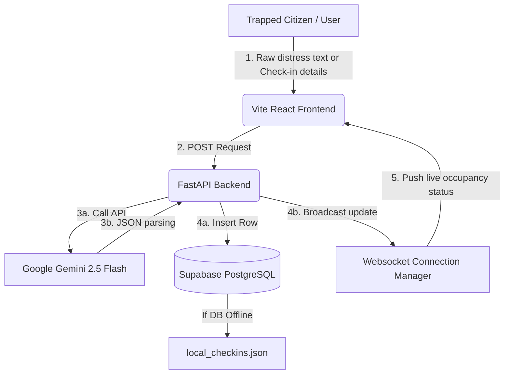

# Vigilant-X: AI-Powered Disaster Management System
> **An Intelligent Platform for Real-Time Threat Monitoring, Emergency Analysis, and Autonomous Resource Allocation**

---

## 📌 Executive Summary & Abstraction

**Vigilant-X** is an advanced, full-stack disaster response and mitigation intelligence system. Traditional disaster response platforms are passive dashboards that merely display reports. Vigilant-X changes this paradigm by serving as an **active, autonomous responder**. 

The system leverages **Google Gemini-2.5-Flash** to analyze natural language distress calls, dynamically calculates dynamic threat containment radii, computes safe evacuation routes bypassing active fires or floods, and manages a live prioritized queue for rescue squads. It features a modern, high-performance web client integrated with real-time WebSockets to broadcast live status changes across relief centers.

---

## 🎯 Project Objectives

1. **Reduce Emergency Response Latency**: Instantly classify raw citizen distress reports into severity tiers, extracting crucial details (type of danger, location, special vulnerabilities like pregnancy or age) without manual triaging.
2. **Dynamic Risk Visualization**: Provide emergency management commanders with an interactive geospatial dashboard mapping hazard zones in real-time.
3. **Optimized Evacuation Planning**: Mathematically calculate safe travel paths that avoid active hazard radiuses, routing citizens to the nearest shelter with available beds.
4. **Resilient Data Logs**: Build a secure registry to log trapped citizens' names, locations, and conditions directly into Supabase PostgreSQL, ensuring zero data loss during high-stress scenarios.

---

## 🌟 Core Features

### 1. Geospatial Live Threat Monitoring
* **Dynamic Leaflet Map**: Render active disaster nodes, custom containment heatmaps, and danger zones based on actual severity.
* **Global Feed Integrations**: Pull live feeds for wildfires (NASA FIRMS), earthquakes (USGS), and weather anomalies (OpenWeatherMap).
* **Risk Zone Overlays**: Visualizes critical, high, and moderate risk containment areas.

### 2. Gemini AI Emergency Chatbot & NLP
* **Gemini-2.5-Flash Engine**: Translates natural language distress messages into structured JSON containing safety titles, severity levels, confidence indexes, and immediate life-saving guidelines.
* **Dual-Language & Dialect Support**: Handles multilingual user inputs (English, Hindi, Bengali, Telugu).
* **Resilient Heuristic Fallback**: Includes a built-in keyword-matching heuristic engine that takes over if the Gemini API meets service limits or network disconnects.

### 3. Dynamic Priority Queue & Rescuer Routing
* **AI Prioritization Scorer**: Automatically calculates urgency scores (0–100) based on age vulnerabilities (infants and elderly receive higher priority) and emergency type (medical/fire rank above resource requests).
* **Hazard-Bypassing Routing**: Renders pathways between the citizen and the shelter, penalizing routes that enter active wildfire or flood sectors.

### 4. Interactive Emergency Registry (Check-In)
* **Distress Pop-up Form**: A focused modal capturing name, situation (e.g. *pregnant flooding area*, *trapped in landslide*), and location.
* **Live Occupancy Updates**: Utilizes WebSockets to stream real-time occupancy updates, preventing overcrowding of emergency shelters.
* **Dual Persistence**: Saves entries directly to Supabase (`shelter_checkins`) with local file-system caching if connection issues occur.

---

## ⚙️ AI Models & Tech Stack

### 1. Generative AI & Machine Learning Models
* **Google Gemini-2.5-Flash (via REST API)**: The core NLP engine. Prompted with system-level emergency personas, it acts as a zero-shot classifier returning clean JSON.
* **Scikit-Learn (LinearRegression)**: Dynamic regression models trained on-the-fly inside the FastAPI app to predict flood extents based on local hourly rainfall forecasts.
* **Heuristic Wind Model v1**: Evaluates wind vector angles to forecast direction and rate of wildfire spread.
* **Rule-Based Prioritizer**: Keyword heuristic parsing matching critical phrases (*"trapped"*, *"pregnant"*, *"bleeding"*).

### 2. Full-Stack Technology Stack
* **Frontend**: React.js, Vite, Leaflet.js, OpenStreetMap, Recharts (visual statistics), Zustand (state management).
* **Backend**: FastAPI (Python), Uvicorn Web Server, WebSockets.
* **Database**: Supabase PostgreSQL database (real-time subscriptions, indexing, schema validations).

---

## 🚀 Unique Value Proposition (What Differs from Other Projects?)

| Feature | Legacy Systems | Vigilant-X |
| :--- | :--- | :--- |
| **Response Model** | Passive logging (manual human sorting) | **Autonomous AI-triage** (instant Gemini parsing and priority scoring) |
| **Geospatial Intelligence** | Simple markers on a static map | **Live hazard bypass routing** (actively adjusts routes around fires/floods) |
| **System Resilience** | Fails entirely during database drops | **Dual persistence** (automatic offline JSON logging + database sync) |
| **Language Processing** | Form-fields only | **Free-text dialogue** (accepts descriptions like *"trapped in landslide"* and matches it to local shelters) |

---

## 📐 System Abstraction Architecture

---

## 📖 Presentation Slide Structure Guide

* **Slide 1: Title & Project Identity** (Vigilant-X, system taglines)
* **Slide 2: The Core Problem** (Manual disaster triage is slow; lives are lost during the "Golden Hour" of response)
* **Slide 3: Objective** (Real-time tracking, immediate AI assessment, safe routing)
* **Slide 4: System Architecture** (Briefly describe the React-FastAPI-Supabase structure)
* **Slide 5: Generative AI Integration** (Detailing the use of Gemini 2.5-Flash for unstructured distress calls)
* **Slide 6: Live Demo Highlights** (Showcase the check-in modal with freeform condition entry and location logging)
* **Slide 7: Conclusion & Scope** (Explain how this ready-to-run prototype can scale to national-level smart city infrastructures)
